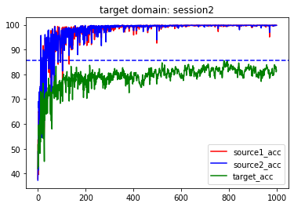

# MSDA
###Introduction  

Multiple Source Domain Adaptation with Adversarial Learning
GAN is wildly applied in Domain Adaptation, which tries to align data with different distribution into the same. The idea of this research is quite similiar to this paper, with similiar architecture, [https://arxiv.org/abs/1705.09684 ].  

The code refers code from this repo https://github.com/daoyuan98/MSDA and https://github.com/pumpikano/tf-dann . Actually, the DANN(single-source-DA) is used as a baseline method.  

The dataset is not provided here since it's too large. The dataset I used is called SEED, which is a EEG dataset for emotion classification developed by Shanghai JiaoTong University. It's an open-source dataset, you can refer here.[http://bcmi.sjtu.edu.cn/home/seed/]
All code is provided by jupyter notebook with excuted records.
###Results
  
  
#####1. The Classfication Accuracy, the Domain Accuracy and Loss.(epoch of 1000)

